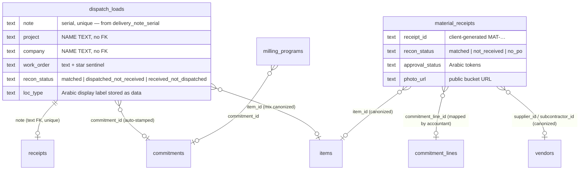
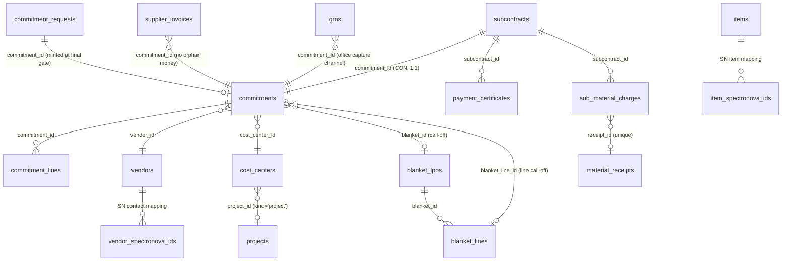
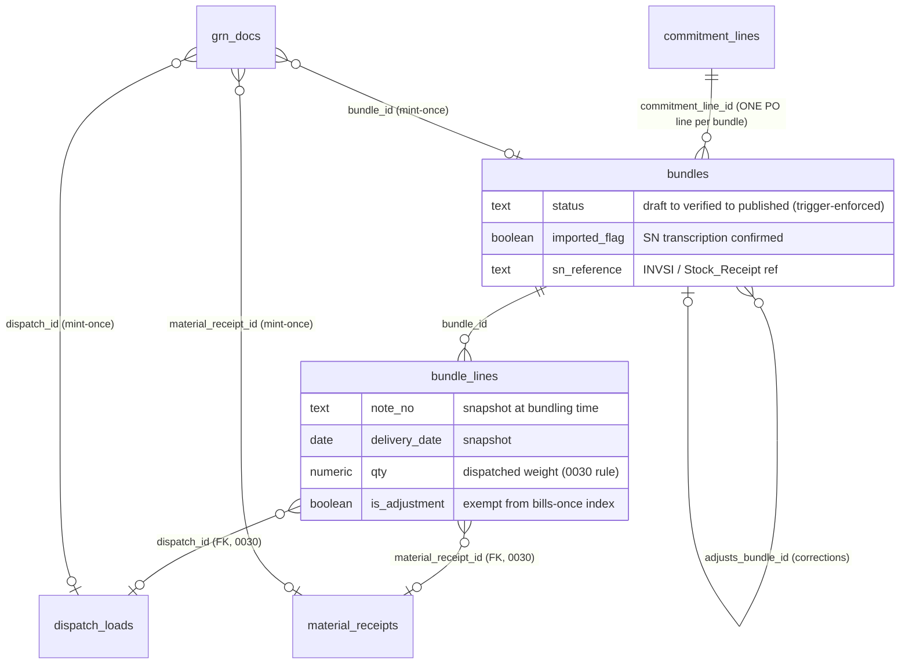

# Database Schema & Architecture Audit — copri-asphalt

**Date:** 2026-08-10 · **Scope:** Supabase project `abwsxqnppihrmkhydkai`, migrations `0001`–`0030`, RPC surface, and the query patterns of all three app generations (legacy `index.html`, React `app/`, blueprint `map/`). **Read-only engagement — no code, migrations, or hosted data were changed.**

Evidence base: every migration file was read in full; the app-side inventories were compiled from the actual source (legacy app: 41 relations + 36 RPCs touched; React app: 44 relations + 34 RPCs; map: 3 tables + 4 RPCs). Everything DB-side that the repo cannot prove is in §5 (checklist) or §7 (hypotheses), not in the findings.

---

## 1. Executive summary

### ⚠ Security first (as requested, before anything else)

**Anyone on the internet holding the app's public key — which ships in every page — can write operational records and read the company's entire commercial dataset.** Specifically:

1. **Field-side write RPCs have no server-side authentication at all.** `dispatch_submit`, `confirm_receipt`, `milling_submit/decide/revise`, `asphalt_program_submit/set_status`, `recipient_request_submit/decide`, and `work_order_add` are granted to `anon` and verify nothing — the "who" is just a text argument. An attacker doesn't even need a PIN to mint real delivery-note serials, confirm receipts (which drives a note to `matched`, i.e. bundleable/billable), approve recipient requests, or remap work orders.
2. **Staff PINs are downloadable.** `ref_payload()` returns every clerk, engineer, and milling-manager PIN to any anonymous caller, and `plant_managers` / `finance_managers` are anon-readable including their `pin` columns. Both apps then compare PINs **in client-side JavaScript** and cache the full PIN list in `localStorage`.
3. **The company's cost structure is anon-readable**: `commitments` (PO values), `supplier_invoices`, `payment_certificates`, `subcontract_overview`, `internal_invoices`, and the full `pipeline_audit` trail all carry `anon read` policies.

To be fair and precise: **this is a documented, deliberately accepted interim posture**, not an oversight — CLAUDE.md and SECURITY.md both state it, the newer modules (`pipeline_users`, `blueprint_reporters`: RLS with *no* read policy, PINs never leave the DB) prove the team knows the correct pattern, and 0029/0030 already started tightening (token hidden, bundles restricted to published-for-anon). The practical likelihood of attack is low (obscure app, targeted effort needed). But with accounting live and bundles feeding SpectroNova, the *consequence* of a forged receipt or fake dispatch is now financial, not just operational. **The planned auth phase is no longer a nice-to-have; it should be the next DB work, before the dispatch/materials/accounting augmentation.** (Findings F1–F3.)

### Overall verdict

**Structurally sound at the core, with one architectural debt (identity), one process debt (no canonical schema / drift risk), and a well-defined security cleanup that is already planned but not yet executed.** The write path is genuinely well-engineered: atomic SECURITY DEFINER RPCs with idempotency refs everywhere, DB-allocated serials, trigger-enforced lifecycle state machines, gapless counters, real FK discipline in everything built after 0013, and an append-only audit trail with PIN redaction. This is far better than typical for a system that grew this fast. The problems are concentrated at the edges: the two oldest log tables are still Sheets-shaped, identity is scattered across seven per-portal tables, and nobody can currently prove the hosted database matches the repo.

### Direct answer to the table-editor question

**What you saw in the Table Editor is about 56 tables + ~15 views. Most of the fragmentation is principled; one area is accidental.**

- **Principled:** the pipeline/accounting core is textbook normalization — `vendors` / `items` / `cost_centers` (masters) → `commitments` / `commitment_lines` (documents) → `bundles` / `bundle_lines` / `grn_docs` (billing) is one coherent chain with real foreign keys. Small config tables (`approval_rules`, `approval_chain_gates`, `pipeline_settings`, `list_options`) are separate *on purpose* so finance can edit them without deploys. None of this should be merged.
- **Accidental:** the **people**. Seven separate tables represent "a person who can log in" (`clerks`, `staff`, `milling_managers`, `plant_managers`, `finance_managers`, `blueprint_reporters`, `pipeline_users`), each born with its portal, each with its own PIN, none linked to the others — the same person appears in several with different PINs. Your instinct that "clerks alone, staff alone, approvals alone" looks wrong is **correct for the person tables and incorrect for the approvals tables** (approval state legitimately lives on the documents it approves — `commitment_requests.gate_log`, `material_receipts.approval_status`, `bundles.status` — that's normal design, not fragmentation).
- **Leftovers:** a third, smaller category is superseded tables kept as fallbacks (`suppliers`, `subcontractors`, `material_catalog` → replaced by `vendors`/`items`; `export_batches`/`export_rows` and the recharge layer → retired in favor of published bundles; `grns` vs `grn_docs` — two different things both named "GRN"). These are harmless today but each one is a trap for the next developer. They should be explicitly marked deprecated, not silently kept.

### The three priority modules in one paragraph each

- **Dispatch** — the serial mechanism is correct and race-safe (sequence + collision-skip loop + client-ref idempotency; verified in `0004`/`0014`). The weakness is the row shape: `dispatch_loads` still joins to everything by Arabic *name text* (project, company, site) and stores a display label as data (`loc_type`), a Sheets inheritance that already caused one production data fix (`0002`'s Green Line respelling) and makes every rename a data migration. It also has **no audit trail** despite being mutated after insert (receipt status, work-order remaps, corrections like `0010`).
- **Materials** — the capture model (raw capture → accountant maps + approves in the daily batch → `matched`) is well thought out and the `no_po` exception path is modeled honestly. The insert-time trigger that force-resets approval fields closes the obvious client-tamper hole. Residual issues: the insert itself is the one remaining direct anon table write, and receiver identity is a free-text name.
- **Accounting** — the strongest module. Lifecycle `draft → verified → published` is enforced **in the database** (triggers, not UI), published bundles are immutable with an adjusting-bundle correction path, one-note-bills-once is a partial unique index on real FKs (since `0030`), GRN-C numbers mint once per target race-safely, and PO balances are computed in a view (no stored-vs-computed divergence possible). The chain dispatch → receipt → match → bundle → GRN → SN export is navigable by FK from `bundle_lines` down; the only string-joined link is dispatch ↔ receipts on the note number, which is at least a real FK on a unique column.

### What to do, in order (details in §6)

1. Run the §5 verification SQL (30 min) — everything else assumes the hosted DB matches the repo.
2. Commit a canonical schema snapshot and adopt a drift check ritual (half a day).
3. Execute the already-planned auth phase — flip `auth_required`, consolidate identity onto `pipeline_users`, remove anon PIN exposure and anon write grants (the one genuinely substantial pre-augmentation project: ~1–2 weeks staged).
4. Only then build the next phase on dispatch/materials/accounting.

---

## 2. Schema map

~56 tables, ~15 views, ~45 client-callable RPCs. Grouped by domain (names are the physical tables; views in *italics* in the notes).

### 2.1 Field operations (dispatch · receipt · materials · milling)



Notes: `receipts` stores the decision **and** mirrors it onto `dispatch_loads.status`; recon status is trigger-maintained on both channels; *`note_recon`* / *`note_bundle_ready`* are the union views the accountant works from. `work_orders` (ministry revenue side) is deliberately never joined with the pipeline's WO commitments — correct, keep it.

### 2.2 Commitment pipeline / PO register



Notes: everything here is surrogate-key FK joined — this is the healthy core. Approval flow is config (`approval_chain_gates`) + per-request state (`chain`, `current_gate`, append-only `gate_log`). Numbering is the gapless `pipeline_counters` upsert. `pipeline_audit` receives every change with before/after row images (PIN-redacting variant for `pipeline_users`).

### 2.3 Accounting / billing chain (the value chain of the three priority modules)



Notes: *`po_line_balance`* derives order/published/pending/remaining per line — computed, never stored. *`bundle_transcription`* is the frozen 12-column SN contract; `sn_page_data(token)` filters it to published. End-to-end navigability: **clean FK from bundle_lines down to both note tables (since 0030); the dispatch↔receipt link is a text-note FK; the note→project/company link is name text (F4).**

### 2.4 People (the accidental fragmentation)

| Table | Portal | PIN storage | Anon-readable? | Auth linkage |
|---|---|---|---|---|
| `clerks` | dispatch | plaintext | **yes (incl. PIN, + via `ref_payload`)** | none |
| `staff` | engineer/receiver | plaintext | **yes (incl. PIN, + via `ref_payload`)** | none |
| `milling_managers` | milling PM/Marco | plaintext | **yes (incl. PIN, + via `ref_payload`)** | none |
| `plant_managers` | plant desk | plaintext | **yes (incl. PIN)** | none |
| `finance_managers` | finance desk | plaintext | **yes (incl. PIN)** | none |
| `blueprint_reporters` | map | plaintext | no (RLS, no policies) ✔ | none |
| `pipeline_users` | pipeline + accounting | plaintext | no (RLS, no policies) ✔ | `auth_user_id → auth.users` ✔ |

One real person can appear in several rows with different PINs (e.g. the seed data has Fouad at `blueprint_reporters` PIN 5729 and `pipeline_users` PIN 7764). Only `pipeline_users` can ever link to Supabase Auth. This is the table Fouad's "clerks alone, staff alone" impression pointed at — and here the impression is right.

---

## 3. Findings

Severity ordering within the priority modules first, then the rest. Every claim below is repo-evidenced; anything needing the live DB is in §5/§7.

### Cross-cutting security & identity

**F1 · CRITICAL — Unauthenticated write surface + exposed PINs (documented interim posture, but now financially consequential)**
*Evidence:* `0002:306-309`, `0004:83`, `0006:173-176`, `0008:75` — `dispatch_submit`, `confirm_receipt`, `milling_submit/decide/revise`, `asphalt_program_*`, `recipient_request_*`, `work_order_add` all `grant execute … to anon` with no identity check in the body (the `p_clerk` / `p_engineer` / `p_by` args are free text). `0001:298-313` — `ref_payload()` returns `clerks.pin`, `staff.pin`, `milling_managers.pin` to anon; `0006:164-171` — `plant_managers`/`finance_managers` anon-readable including `pin`. Legacy app compares PINs in JS (`index.html:2753`, `:2816`, `:4999`, `:5449`) and caches the full payload incl. PINs in `localStorage` (`index.html:4213`); React app does the same (`app/src/screens/capture/CaptureLogin.tsx:33`, `boards/PinGate.tsx:41`).
*Risk in concrete terms:* anyone with the public key (in every page's source) can (a) consume real delivery-note serials with fabricated dispatches, (b) confirm a receipt as any engineer, driving a note to `matched` — the gate for **billing** — and (c) approve recipient requests / remap work orders. Since bundles feed SN transcription, this is a path from "anonymous internet request" to "billable record."
*Mitigating context (honest):* documented and accepted in CLAUDE.md ("v1 posture") and SECURITY.md; pipeline/financial writes are properly gated (`pipeline_auth`, no PIN exposure); attack requires targeted knowledge of an obscure app; the accountant's manual bundling is a human checkpoint.
*Recommendation:* execute the planned auth phase as the **next** DB work. Minimum viable hardening, in order: (1) strip PINs from `ref_payload()` and drop anon read on the five PIN tables, replacing client-side checks with `*_check(p_pin)` RPCs (the `blueprint_reporter_check` pattern already in the repo — mechanical); (2) add a PIN argument + server check to the field write RPCs; (3) flip `auth_required` for office roles. Step 1 alone kills the PIN harvest and costs roughly a day including client changes.

**F2 · HIGH — All commercial data is anon-readable**
*Evidence:* `0013:536-547`, `0014:181-182`, `0015:50-56`, `0016:50-56`, `0018:67-68`, `0021:85-94`, `0022:55-56` — `anon read using (true)` on `commitments`, `commitment_lines`, `supplier_invoices`, `internal_invoices`, `grns`, `subcontracts`, `payment_certificates`, `sub_material_charges`, `blanket_*`, and `pipeline_audit` (which contains full before/after row images of all of the above).
*Risk:* PO values, subcontract retention terms, invoice amounts, and vendor pricing are downloadable by any competitor or counterparty who finds the key. `pipeline_audit` makes this worse: even later-tightened tables leak via their audit images.
*Recommendation:* in the auth phase, mirror the 0030 bundles pattern across the pipeline: `authenticated` full read, anon nothing (or narrowly scoped). Don't forget `pipeline_audit` — it should be authenticated-only (or admin-only) from day one of the tightening.

**F3 · HIGH — Identity is modeled seven times; only one copy can ever link to real auth**
*Evidence:* table list in §2.4. `auth_user_id` exists only on `pipeline_users` (`0017:25-29`); `pipeline_user_link_self` (`0017:125-148`) is the only PIN→auth linking flow. The planned PIN-gated sign-up therefore lands cleanly **only** for pipeline users; clerks/engineers/receivers/plant/finance/blueprint people have no table it can land on.
*Risk:* the auth phase either (a) builds seven parallel linking flows, or (b) does the consolidation then — under time pressure, with live sessions depending on the old tables. Every new portal until then adds an eighth table (the pattern has repeated five times already).
*Recommendation:* decide **now** that `pipeline_users` is the single person table (rename conceptually to "app users"; physical rename optional). Auth-phase migration: add capability flags or a small `user_roles` table for the field roles (clerk / engineer / receiver / plant_manager / finance_manager / blueprint_reporter), backfill rows from the seven tables (dedup by person, one PIN each), re-point the five `*_check` flows, then drop or freeze the old tables. `staff.project_id` scoping maps directly onto the existing `pipeline_user_centers` mechanism. Estimate: 2–4 days DB + client, inside the auth phase. This is the single highest-leverage schema change available before the platform becomes "everything lives here."

### Dispatch (priority module 1)

**F4 · MEDIUM — `dispatch_loads` (and `material_receipts`, `milling_programs`) join the world by Arabic name text**
*Evidence:* `0001:151-176` — `project`, `company`, `site`, `work_order` all text, no FKs; `0015:87-88` / `0014:39-49` — `recharge_run` and `resolve_internal_wo` join `projects p on p.name = d.project`; recon/audit-queue filters use `trim(d.company) = 'كوبري'` / `company=in.(…)` with client-side re-quoting (`index.html:6954-6956`); `loc_type` stores the Arabic display label as data (`0002:175-176`), reverse-mapped to a code in both clients. The `0002:156-157` Green Line respelling and the `0010` street correction are the recorded cost of this design.
*Risk:* renaming a project/company/site silently orphans history in the three log tables and every view over them; the internal-recharge and cost-center resolution silently drop rows on any spelling drift. This is the main schema decision that will hurt when projects multiply beyond the current two.
*Recommendation:* don't rewrite history — add nullable `project_id` (FK) to the three log tables, stamp it in `dispatch_submit`/insert triggers going forward, backfill by name-match once, and migrate the name-joins (`resolve_internal_wo`, recharge, recon channel filters) to the id. Names stay as display snapshot columns. ~1–2 days, safe to do incrementally, and it future-proofs the exact joins the next phase will build on. Do the same for `company` → `companies.id` on dispatch. (`loc_type` recoding is cosmetic — defer.)

**F5 · MEDIUM — No audit trail on dispatch mutations**
*Evidence:* `dispatch_loads` has no audit trigger (grep of migrations: `trg_pipeline_audit` covers pipeline tables + `material_receipts` updates (`0018:234-235`) + `grn_docs`, never `dispatch_loads` or `receipts`). Yet dispatch rows mutate after insert: `confirm_receipt` rewrites `status` (`0002:201`), `work_order_add` remaps `work_order` (`0008:56-60`), corrections like `0010` rewrite location fields, and recon triggers rewrite `recon_status`.
*Risk:* dispatch is now a billing input (bundle qty = dispatched weight). If a weight or location is ever disputed, there is no record of what changed when — while milling (operationally less critical) has a full jsonb audit trail. Corrections currently require hand-written migrations (`0010`) precisely because there's no safe edit path.
*Recommendation:* attach the existing `pipeline_audit_row()` trigger (update/delete only — insert would double-log every load) to `dispatch_loads` and `receipts`. One migration, ~15 lines, reuses infrastructure that already exists. Do it *before* the dispatch augmentation phase, so the new features inherit it.

**F6 · LOW — `load_number` is computed client-side (race-prone)**
*Evidence:* `index.html:1454-1468` / `app/src/screens/dispatch/helpers.ts:155` — the per-location shift counter fetches rows and counts in JS, then submits `p_load_number`.
*Risk:* two clerks dispatching to the same location simultaneously get the same load number. Today it's a printed-label nicety, not a key — no integrity impact.
*Recommendation:* leave it, or fold the count into `dispatch_submit` when the RPC is next touched. Not worth its own change.

**F7 · LOW — Serial gaps are possible (and already accepted)**
*Evidence:* `0004` collision-skip loop; `0004b` documents historical typo'd numbers the sequence will someday skip past; a crashed transaction after `nextval` leaks a number (inherent to sequences).
*Risk:* the printed series can have holes, which matters only if someone audits it as gapless like the carbon book. The repo already accepts this trade-off for race-safety — correct call.
*Recommendation:* none (documented behavior). Sound, leave alone.

### Materials (priority module 2)

**F8 · MEDIUM — The one remaining direct anon table write, with client-generated identity**
*Evidence:* `material_receipts` anon insert policy survives from `0001` (CLAUDE.md confirms it's the deliberate last direct write); `receipt_id` is client-generated (`index.html:3731-3733` — year + `Date.now()` base36), `receiver` is free text. The `0018:217-230` gate trigger properly force-resets approval fields, so the *financial* controls hold.
*Risk:* spam/garbage rows from anyone with the key (cleanup burden, audit-queue noise — not a financial hole, thanks to the gate + daily batch). Client-generated `receipt_id` can collide across simultaneous submitters in the same millisecond-space (practically negligible at this volume).
*Recommendation:* in the auth phase, convert to a `material_receipt_submit` RPC (PIN/JWT-checked, server-generated id, same idempotency pattern as `dispatch_submit`) and drop the anon insert policy. The offline queue in the React capture app already retries idempotently, so this is a clean swap. ~1 day including both clients.

**F9 · LOW — Receipt photos live in a public bucket**
*Evidence:* `0001:272-283` — `material-receipts` bucket public read; URLs stored as full text in `photo_url`. SECURITY.md already lists authenticated serving + EXIF strip as pre-launch.
*Risk:* low sensitivity (paper receipt photos), unguessable-ish names; mostly a privacy hygiene item.
*Recommendation:* keep as tracked pre-launch item; store bucket-relative paths rather than absolute URLs when next touched (makes a future bucket/privacy change a config edit, not a data migration).

**F10 · LOW — Superseded reference tables still live as silent fallbacks**
*Evidence:* `suppliers` / `subcontractors` / `material_catalog` demoted to "pre-0025 fallback only" (DECISIONS.md) but still served by `ref_payload()` and still editable in the Table Editor; staff editing the wrong table now produces edits that silently don't reach the canonical dropdowns.
*Risk:* master-data drift between the old and new tables; new-developer confusion.
*Recommendation:* one cleanup migration: stop serving the legacy keys from `ref_payload()` once the legacy capture form retires, and either drop the tables or revoke their Table-Editor visibility. Half a day, schedule with the legacy-portal switch-over.

### Accounting (priority module 3)

**F11 · MEDIUM — Two unrelated things are both called "GRN", plus a retired export layer still live**
*Evidence:* `grns` (`0014:160` — pipeline office-capture channel, GRN-YYYY-NNN series, reachable from unmounted React screens + legacy `?rf`) vs `grn_docs` (`0030:165` — accounting print registry, GRN-C-#### series). Separately, `export_batches`/`export_rows`/`export_pending` + `recharge_rates`/`internal_invoices` were retired in favor of published bundles (DECISIONS.md 2026-07-14) but their tables, RPCs (`export_batch_create`, `recharge_run`, …) and anon grants remain fully live.
*Risk:* not integrity — confusion. The next developer (or next Claude session) has two GRN tables, one dead export pipeline, and no in-schema marker saying which is current. Retired-but-granted RPCs are also needless attack/change surface (`recharge_run` is still callable and still generates invoices).
*Recommendation:* a "deprecation ledger" migration: `comment on table grns is 'DEPRECATED-ish: pipeline office capture channel — accounting print registry is grn_docs'` etc., revoke execute on the retired RPCs, and add a `-- RETIRED` banner comment to the 0015/0016 heads. 2–3 hours, zero behavior change for live modules, large clarity payoff. (Physical drops can wait until the legacy portal retires.)

**F12 · LOW — `bundle_lines` carries the note reference twice**
*Evidence:* `0030:104-160` — `note_source`/`note_ref` (legacy) and `dispatch_id`/`material_receipt_id` (FKs) coexist, kept in lockstep by the guard trigger.
*Risk:* none while the guard is the only write path (it is). Pure carrying cost.
*Recommendation:* sound for now — leave alone. Drop `note_source`/`note_ref` in a later cleanup once the legacy accounting tab is fully retired and views are re-pointed.

**F13 · LOW — Status vocabulary is trilingual across the schema**
*Evidence:* Arabic tokens on v1 tables (`'في الطريق'`, `'نشط'`, `'معتمد'`…), English tokens on recon/bundles (`matched`, `draft`…), and both mapped to i18n keys client-side; `bundles.status` English while its sibling `commitments.status` is Arabic.
*Risk:* cosmetic + onboarding friction; each client carries translation maps. Already a recorded decision (DECISIONS.md: recode "waits for a dedicated migration").
*Recommendation:* sound to defer. When the identity/auth migration happens anyway, that's the natural moment to recode the Arabic status columns to English tokens behind the existing `statusKey()` shims — not before.

**F14 · LOW — Accounting works over silently capped windows**
*Evidence:* audit rows `PAGE = 300` (`app/src/screens/accounting/data.ts:573`), `po_line_balance` fetch `limit(2000)`, `bundle_transcription` DN→PO map `limit 2000` (`data.ts:403-411`), bundles list newest-200; the caps are acknowledged in DECISIONS.md ("one accountant, correctness first").
*Risk:* none today; at ~10× volume the DN→PO map and PO options silently omit rows (a GRN would print a blank PO box rather than a wrong one — fail-soft, but invisible).
*Recommendation:* accept for now; when dispatch volume grows, move the DN→PO resolution server-side (a small view keyed on note_no) rather than raising client caps.

### Performance & scale (sanity check, not tuning)

**F15 · MEDIUM — `dash_payload()` returns every dispatch and material row ever recorded, on every dashboard load**
*Evidence:* `0001:337-373` — no date filter, full-table JSON aggregation of both logs; called on every board open and range-tab render is client-side by design.
*Risk:* strictly linear degradation with dispatch volume — the one query pattern in the system guaranteed to get slower every single day. At Sheets-era row counts it's fine; at "company-wide operations app" scale it's the first thing that will visibly hurt (payload size + Postgres JSON build time).
*Recommendation:* cheap win when boards are next touched: add an optional `p_since date` argument defaulting to ~400 days and have the client pass the widest tab it actually renders. One migration + two call sites. No index work needed (`dispatch_ts` already exists).

**F16 · MEDIUM — The map will silently drop the *newest* dispatches once volume passes 10,000 rows**
*Evidence:* `blueprint/src/store.ts:86-88` — `order=ts.asc&limit=10000`: ascending order + limit keeps the **oldest** 10k rows.
*Risk:* not current (volume is low), but the failure mode is nasty when it arrives: the map keeps working and quietly stops showing recent work — no error, wrong conclusions.
*Recommendation:* one-line fix next time the blueprint is touched: `order=ts.desc` (or a `ts=gte.` season filter). Flagging now because silent-truncation bugs are cheapest fixed before they fire.

**F17 · LOW — N+1 patterns in the clients (not the RPC layer)**
*Evidence:* per-note GRN minting fires up to 200 sequential `grn_doc_no` RPCs in one `Promise.all` (`GrnScreen.tsx:86-87`); subcontract/match drill-downs fetch 2–4 queries per expanded row; audit tiles issue one head-count per status. The DB-side RPC layer itself is clean — the pipeline was explicitly built to avoid N+1 (e.g. `subcontract_overview`, `po_line_balance` are single-query views).
*Risk:* latency only, one-user screens, current volumes trivial.
*Recommendation:* only the GRN batch is worth changing (a `grn_doc_nos(jsonb)` batch variant, ~1 hour) — and only when someone actually prints a large batch and notices. The rest: leave alone.

**Index coverage — sound, leave alone.** Hot paths are covered: `dispatch_ts`, `dispatch_project_ts`, `dispatch_loads_by_recon`, `receipts_note_key` (makes the `note_recon` lateral a unique-index probe), `material_receipts_pending`/`_by_recon`/`_by_line`, `bundles_by_status`, `bundle_lines_by_bundle`, partial indexes on the bills-once/mint-once constraints, `commitment_requests_queue`. Two cheap additions worth taking opportunistically, not urgently: `dispatch_loads (company)` (audit-queue Copri filter) and `dispatch_loads (work_order)` (the `'*'` remap scans) — both currently sequential-scan filters on the largest table.

### Migration & environment hygiene

**F18 · HIGH — No canonical schema, and no way to prove the hosted DB matches the repo**
*Evidence:* `0030` is a **delta** despite its name (`rebuild_schema` changes ~4 areas; it supersedes nothing). Current truth = mentally replaying 31 files, including 4 versions of `request_submit` and 3 of `request_decide`. Migrations are hand-pasted (CLAUDE.md); the `PASTE_PENDING_*` bundles say "delete after pasting" yet still exist; whether `0023`, `0029`, `0030` actually landed is an open item in the project's own notes. The repo's own history contains a near-miss: `0004b` exists because a derived assumption about live data was wrong.
*Risk:* every finding in this report is conditional on the hosted DB matching the files. Silent drift (a paste skipped, a Table-Editor tweak, a hand-run fix) is invisible until something breaks — and 0024/0030's trigger-driven backfills mean *partial* pastes leave the DB in shapes no migration file describes.
*Recommendation:* (1) Run the §5 checklist now — it settles 0023/0029/0030 in minutes. (2) Commit a generated snapshot: run `supabase db dump --schema-only` (or dashboard → Database → Schema) and check it in as `supabase/schema_snapshot.sql`, regenerated after every paste — this becomes the canonical "current schema" a new developer reads instead of 31 deltas. (3) Keep the paste ritual (it's fine at this team size) but make "regenerate snapshot + delete the PASTE_PENDING file" part of it. Half a day to set up, near-zero ongoing cost.

**F19 · LOW — Single production environment**
*Evidence:* one Supabase project, migrations tested by pasting into prod (CLAUDE.md's own test guidance is "use TEST-prefixed ids and delete them").
*Risk assessment (honest, for a company this size):* a full staging environment is **not** justified — the cost of keeping it faithful exceeds the benefit for a 1-developer, hand-paste workflow. The real risks are (a) a destructive migration typo and (b) unverified backups.
*Recommendation:* two cheap mitigations instead of staging: verify the Supabase plan's backup/PITR status and do one restore drill (checklist item in §5 — SECURITY.md already flags backups as open); and for *destructive* migrations only (drops, backfills), rehearse against a scratch Supabase project or a local `supabase start` first. Additive migrations can keep the current ritual.

### Fitness for the target end state ("everything eventually lives here")

**F20 · MEDIUM — The name-text log columns are the load-bearing weakness for growth** — this is F4 wearing its future-cost hat: more projects, more contracts, billing re-enabled, and every one of them joins through `projects.name = d.project`. Fix per F4 *before* the next build phase; everything downstream (recharge, recon, boards, map) simplifies once the id exists.

**F21 · LOW — Milling completion time lives inside a jsonb audit array**
*Evidence:* `0015:97-99` — recharge extracts `max((e->>'ts')::timestamptz) where action='completed'` from `milling_programs.audit` to bucket the billing month.
*Risk:* fragile the day milling billing matters (audit-array edits change invoices); unqueryable without unpacking jsonb.
*Recommendation:* when milling gets its next phase, add a plain `completed_at timestamptz` stamped by `milling_decide` and backfill from the array. Not before — milling is secondary.

**F22 · LOW — Blueprint report ids use a random 4-digit suffix**
*Evidence:* `0011:78` — `BLR-YYMMDD-<random 0000-9999>`; a same-day collision merges two reports (and `blueprint_report_delete` would delete both).
*Risk:* real but small (needs ~45 reports in one day for ~10% collision odds; current usage is single-reporter).
*Recommendation:* switch to a sequence or `gen_random_uuid()` slice next time the RPC is touched. Not urgent.

---

## 4. What's healthy (explicitly)

Calibration matters: most of this schema is in good shape, and the following should **not** be "improved."

1. **Serial-number integrity (dispatch).** DB-owned sequence, atomic allocate+insert, collision-skip for legacy typos, client-ref idempotency for retries — the failure modes (double-submit, dropped response, manual-insert collision) are each explicitly handled. Battle-tested and correct.
2. **The idempotency discipline generally.** `client_ref` + unique partial index + retry-returns-original appears on dispatch, requests, GRNs, manual POs. Consistent, correct pattern.
3. **The bundle lifecycle is DB-enforced.** Forward-only transitions, published-immutability (with the surgical exception for import confirmation), draft-only line edits, only-matched-notes-enter, one-note-bills-once on real FKs, adjusting bundles for corrections — all triggers/constraints, so Table-Editor edits obey the same rules as RPCs. This is the strongest part of the schema.
4. **GRN-C registry.** Mint-once-per-target via partial unique indexes with a race-safe re-select. Reprints provably stable.
5. **PO balances are computed, not stored.** `po_line_balance` derives from lines + bundle lines every read — no stored/computed divergence class of bug exists here.
6. **The pipeline core's FK discipline.** Everything post-0013 uses surrogate keys, no-orphan constraints ("no orphan money": invoices must reference commitments), immutability guards, and gapless per-series counters. The 1:1 extension pattern (`blanket_lpos`, `subcontracts` extending commitments) is clean.
7. **Approval flow as config.** Chains/gates/rules/thresholds as rows, with an append-only `gate_log` and creator≠approver enforced server-side. Adding the PM→Jimmy→Admin chain really is just inserts.
8. **The audit trail (where it exists).** Append-only, before/after images, actor via `set_config`, PIN-redacting variant for the users table. Right design — it just needs to reach dispatch (F5).
9. **Canonization as mapping, never rename.** Raw text preserved, canonical ids resolved server-side by triggers regardless of client version, historical backfills idempotent. This is the correct way to clean masters under a live system.
10. **Timestamps.** `timestamptz` end-to-end; Kuwait wall-clock applied only at query/display edges (`at time zone 'Asia/Kuwait'`). The Sheets-era "ISO strings filtered client-side" hazard the brief warned about does **not** exist in the DB layer.
11. **Constraint discipline.** Status CHECKs added as vocabulary locked down (0002), tightened again per channel (0030) *after* trigger-driven backfills — the right order. Unique keys on natural identities throughout.
12. **`work_orders` vs pipeline WO separation.** Deliberate, documented, correct — revenue-side ministry orders and cost-side subcontractor commitments must not merge.
13. **The security posture *for the money path*.** `pipeline_users` and `blueprint_reporters` PINs never leave the DB; `pipeline_auth` is JWT-first with a kill-switch flag; separation of duties is server-side; the SN token was hidden from anon the moment review caught it (0029). The team demonstrably knows how to do this — F1 is about extending it to the field layer, not learning it.
14. **Migration craftsmanship.** Append-only, extensively commented, deploy-order-aware (RPC-first, revoke-later), overloads dropped explicitly for PostgREST, backfills idempotent. As a *body of work* it's excellent — it just lacks a summary artifact (F18).

---

## 5. Unverifiable-from-repo checklist — SQL for the Supabase SQL editor

> **Partly executed 2026-08-10 — see §8 for live results.** The items reachable through the public REST API (anon key, read-only GETs — exactly what any page visitor issues) were run directly and their answers folded into §8. The remaining items (system-catalog queries: `pg_policies` text, `pg_proc`/`information_schema` inventories, sequence `last_value`, `pg_stat_user_tables`, backup status) still need the authenticated SQL editor; the SQL below is ready to paste for those.

Run in order; each line says what the result means. All read-only.

**A. Did 0023 / 0029 / 0030 actually land?**

```sql
-- A1: 0023 (request lines). Row returned = applied; empty = 0023 NOT pasted.
select column_name from information_schema.columns
 where table_name = 'commitment_requests' and column_name = 'request_lines';

-- A2: 0029 (polish). Row returned = applied.
select proname from pg_proc where proname = 'commitment_lines_canon';

-- A3: 0030 (rebuild). Both must return a row; grn_docs must exist.
select column_name from information_schema.columns
 where table_name = 'bundle_lines' and column_name = 'dispatch_id';
select to_regclass('public.grn_docs') as grn_docs_exists;

-- A4: 0030's tightened status sets. Expect exactly:
--   dispatch: matched | dispatched_not_received | received_not_dispatched
--   material: matched | not_received | no_po
-- If qty_mismatch still appears, 0030 did not land (or landed partially).
select conrelid::regclass as tbl, pg_get_constraintdef(oid)
  from pg_constraint where conname like '%recon_status_check%';
```

**B. Repo-vs-hosted drift (the general check)**

```sql
-- B1: full table inventory. Diff this list against §2's expected set (56 tables);
-- extras = hand-made objects the repo doesn't know; gaps = unpasted migrations.
select table_name from information_schema.tables
 where table_schema = 'public' and table_type = 'BASE TABLE' order by 1;

-- B2: RLS must be ON for every table. Any row returned here is a table with RLS
-- DISABLED — treat as an incident.
select tablename from pg_tables
 where schemaname = 'public' and rowsecurity = false;

-- B3: function inventory (client-callable surface). Compare count/names against
-- the repo (~45 expected).
select proname from pg_proc p join pg_namespace n on n.oid = p.pronamespace
 where n.nspname = 'public' order by 1;
```

**C. Security posture confirmation (F1/F2 ground truth)**

```sql
-- C1: which PIN tables anon can SELECT. Expect all five to appear today
-- (that's F1); after the auth phase this list should be empty.
select tablename, policyname from pg_policies
 where schemaname = 'public' and 'anon' = any(roles) and cmd = 'SELECT'
   and tablename in ('clerks','staff','milling_managers','plant_managers','finance_managers')
 order by 1;

-- C2: auth_required flag (false = PIN fallback still live).
select value from pipeline_settings where key = 'auth_required';

-- C3: pipeline_users must have NO select policies (PINs server-side only).
-- Expect zero rows.
select policyname from pg_policies where tablename = 'pipeline_users' and cmd = 'SELECT';
```

**D. Data-integrity spot checks**

```sql
-- D1: serial position vs data. last_value should be >= the max real note;
-- a big divergence means manual inserts or a reseed happened outside the repo.
select last_value from delivery_note_serial;
select max(note::bigint) from dispatch_loads where note ~ '^12[0-9]{4}$';

-- D2: 0030 FK backfill completeness. Expect 0.
select count(*) from bundle_lines
 where dispatch_id is null and material_receipt_id is null;

-- D3: recon backfill completeness — any lingering old tokens? Expect 0 rows.
select recon_status, count(*) from dispatch_loads
 where recon_status not in ('matched','dispatched_not_received','received_not_dispatched')
 group by 1;

-- D4: name-join health (F4 ground truth): dispatch projects that no longer
-- match a projects row. Rows here = already-orphaned history.
select distinct d.project from dispatch_loads d
 where d.project <> '' and not exists (select 1 from projects p where p.name = d.project);

-- D5: same for company. Rows here = the Green Line class of bug, live today.
select distinct d.company from dispatch_loads d
 where d.company <> '' and not exists (select 1 from companies c where c.name = trim(d.company));
```

**E. Scale reality (informs F15/F16 urgency)**

```sql
-- E1: row counts. dispatch_loads near 10,000 makes F16 urgent; pipeline_audit's
-- count shows audit-growth rate.
select relname, n_live_tup from pg_stat_user_tables order by n_live_tup desc limit 20;

-- E2: index usage sanity — seq_scan-heavy large tables are candidates for the
-- two opportunistic indexes named in F17.
select relname, seq_scan, idx_scan from pg_stat_user_tables
 where n_live_tup > 1000 order by seq_scan desc limit 10;
```

**F. Not SQL, but verify in the dashboard:** backup/PITR status for the plan tier (SECURITY.md lists this open) — and do one test restore to a scratch project. This is the single most important operational item on the list.

---

## 6. Recommended sequencing

**Before the dispatch/materials/accounting augmentation (in this order):**

| # | Work | Why first | Effort (honest) |
|---|---|---|---|
| 1 | Run §5 checklist; settle 0023/0029/0030 | Everything else assumes repo = hosted | 30–60 min |
| 2 | Schema snapshot committed + paste ritual updated (F18) | New work needs a readable current schema | ~half a day |
| 3 | Backup verification + one restore drill (§5F) | Prod-only environment; cheapest insurance available | ~half a day |
| 4 | Auth phase, staged (F1→F2→F3): strip PINs from `ref_payload` + drop anon read on PIN tables + `*_check` RPCs (≈1 day) → PIN-check the field write RPCs (≈1–2 days) → identity consolidation onto `pipeline_users` + PIN-gated sign-up (≈2–4 days) → tighten anon read on commercial tables incl. `pipeline_audit` (≈1–2 days) | The security cleanup is planned anyway; doing it before the augmentation means new features are born gated instead of retrofitted | ~1–2 weeks total, shippable in stages |
| 5 | `project_id`/`company_id` on the log tables + re-point the name-joins (F4/F20) | The augmentation will build on exactly these joins | 1–2 days |
| 6 | Audit triggers on `dispatch_loads`/`receipts` (F5) | 15-line migration; new features inherit history | ~1 hour |
| 7 | Deprecation ledger: comments + revoke retired RPCs (F11) | Stops the next builder from extending dead layers | 2–3 hours |

**Can safely wait (do opportunistically, when the area is next touched):**
`material_receipt_submit` RPC (F8, fold into auth phase step if convenient) · `dash_payload` date window (F15) · map `order=ts.desc` (F16 — one line, do whenever the blueprint is next opened) · GRN batch RPC (F17) · legacy reference-table retirement (F10) · `completed_at` on milling (F21) · blueprint report-id randomness (F22) · the two opportunistic indexes.

**Never bother:**
Merging the config tables ("fragmentation" that is actually correct) · renaming physical tables to the briefs' logical names (already decided, correctly) · recoding Arabic status tokens as a standalone project (piggyback on a bigger migration or skip) · dropping `bundle_lines.note_source/note_ref` while the legacy tab lives (F12) · building a staging environment (F19 — rehearse destructive migrations on a scratch project instead) · any SpectroNova integration beyond the token page (boundary is deliberate and sound).

---

## 7. Hypotheses to verify (explicitly *not* findings — no repo evidence either way)

1. **Hosted-only objects exist** (tables/columns/policies created via Table Editor or ad-hoc SQL that no migration file describes). §5-B1/B3 answers this.
2. **The `0023` paste never happened** — the project notes list it as unconfirmed; if so, the React request form's `p_lines` silently no-ops. §5-A1 answers this.
3. **Orphaned name-joins already exist in production** (projects/companies renamed after logs referenced them). §5-D4/D5 answers this.
4. **`pipeline_audit` is already the largest table** (it receives full row images from ~20 tables including every material-receipt recompute). §5-E1 answers this; if true, a retention/partition decision belongs in the auth phase.
5. **Legacy clients still hold pre-0022 request-submit call shapes** (dropped overloads would make stale cached pages fail loudly). Only observable in PostgREST logs / user reports.
6. **The storage bucket contains non-image or oversized objects** predating the 0002 mime/size limits. Dashboard → Storage answers this.

---

## 8. Verification run — live results (2026-08-10)

Executed read-only against `https://abwsxqnppihrmkhydkai.supabase.co` via the public REST API (anon key, GET only — no writes, no dashboard login needed). Where a checklist item asked "does a policy exist that exposes X," I ran the stronger empirical test — *ask the API for X and see if it hands it over*.

### Headline confirmations

| Check | Result | Verdict |
|---|---|---|
| **F1 — PIN exposure** | `GET /clerks?select=name,pin` → `[{"name":"خالد","pin":"1098"}, …]`; same for `staff` (`"pin":"8798"`…), `plant_managers` (`"1064"`), `finance_managers` (`"6644"`) | **CONFIRMED LIVE.** Real staff names + PINs handed to an unauthenticated caller. `milling_managers` returned `[]` (no rows, not a policy block). |
| **F2 — commercial data** | `GET /commitments` → PO `363-PO/0349` value **743,460**; `GET /pipeline_audit` → before/after rows | **CONFIRMED LIVE.** PO values and the full audit trail are anon-readable. |
| **C3 — pipeline_users** | `GET /pipeline_users?select=id,name,pin` → `[]` | **GOOD.** RLS-no-policy holds; pipeline/accounting PINs never leave the DB. |
| **C2 — auth_required** | `false` | PIN fallback still live (expected; flips in the auth phase). |
| **0030 tightened status model** | dispatch recon: 668 `matched` / 332 `dispatched_not_received`, **zero** other tokens; materials: 153 `not_received`; no `qty_mismatch` anywhere | **0030 landed and backfilled cleanly.** |
| **0029 applied** | `sn_page_token` hidden from anon (`[]`); `po_line_balance.po_status` present | **CONFIRMED applied.** |
| **0023 NOT applied** | `GET /commitment_requests?select=request_lines` → `42703 column … does not exist` | **CONFIRMED DRIFT** (hypothesis 2). 0023 was skipped while 0024→0030 landed — migrations are out of order in prod. Low real impact (the deployed legacy `?rf` client uses the 0022 call shape), but it proves paste-skipping happens and is invisible without a check like this. |

### Data-integrity spot checks — all clean

| Check | Result |
|---|---|
| `bundle_lines` with neither FK set (D2) | **0** — 0030 FK backfill complete |
| dispatch recon anomalies (D3a) | **0** |
| material recon anomalies (D3b) | **0** |
| orphaned dispatch→projects names (D4) | **0** — all 5 in-use projects match a `projects` row |
| orphaned dispatch→companies names (D5) | **0** — both companies match; the 0002 Green Line respelling held |

The integrity fundamentals the report praised are **empirically confirmed**, not just inferred from the migrations.

### Scale snapshot (row counts, live)

`dispatch_loads` **1,007** · `receipts` 673 · `material_receipts` 153 · **`pipeline_audit` 1,712** · `commitments` **424** (headers only — `commitment_lines` = 0, matches "426 imported POs, headers only") · `vendors` 590 · `items` 153. Latest allocated note **126647** (2026-08-09), sequence started 126186 → ~460 printed notes.
*Interpretation:* volumes are small — F15 (`dash_payload` full-scan) and F16 (map 10k cap) are **not** urgent yet, confirming the report's "flag now, fix when touched" framing. `pipeline_audit` is already the 2nd-largest table and grows on every recompute (hypothesis 4 — a retention decision belongs in the auth phase, but it's not pressing at 1,712 rows).

### New finding surfaced by the run

**F23 · MEDIUM — The platform has *already* grown past "two projects," and the new ones have no cost centers.** Live `dispatch_loads` carries **five** projects, not two: beyond `كوبري — صيانة حولي` (754 rows) and `كوبري — الطرق السريعة` (7), there are `صيانة جذرية — العاصمة (النطاق الأول)` (61), `صيانة جذرية — حولي (النطاق الثاني)` (118), and `تحسين البنية التحتية — اليرموك` (60) — 239 rows on projects that didn't exist at the pipeline's design. But `cost_centers` was only seeded for the original two (363/364, migration `0013:52-56`). Because `resolve_internal_wo` and `recharge_run` join `cost_centers.project_id → projects` **by name**, any billing/recharge for the three new projects silently resolves to nothing — no error, no row, just absence. This is F4/F20 (name-text joins) already biting, plus a config gap. *Recommendation:* before the next phase, add `cost_centers` rows for the three live projects (config edit, minutes) **and** prioritize the `project_id` FK work (F4) — the growth the report called a future risk is present tense.

### Still needs the authenticated SQL editor

Not reachable via the anon API; paste §5-A2/A4, B1–B3, C1, D1(sequence `last_value`), E2 into the dashboard SQL editor when convenient. None are likely to change the conclusions — the empirical run already settled every load-bearing question — but B1/B2 (hosted-only tables, any RLS-disabled table) and the backup/restore drill (§5-F) are worth doing for completeness before the auth phase.

---

*End of report. Compiled read-only from the repo at `C:\Users\fszog\Desktop\Copri webapp` (branch `main`, HEAD `786fd2f`); §8 verified live against the hosted database on 2026-08-10.*
